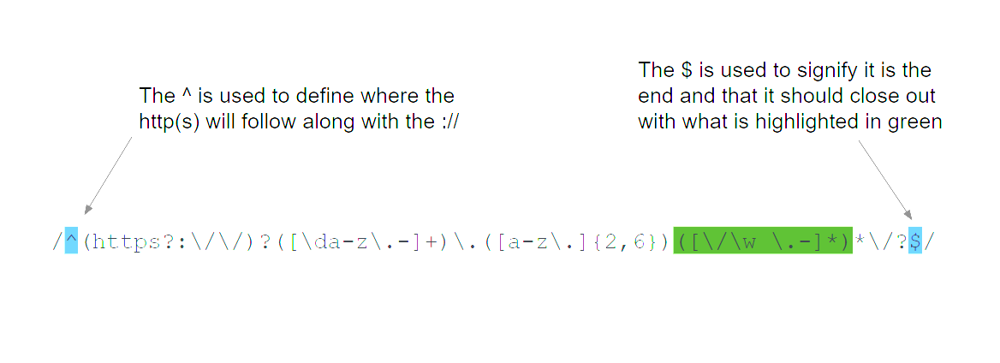
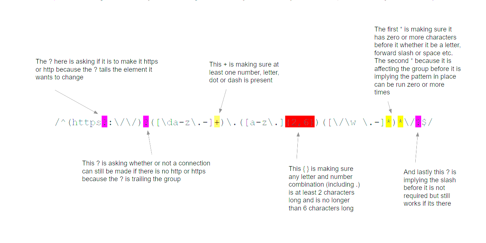
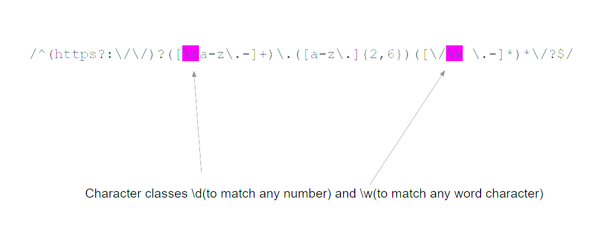
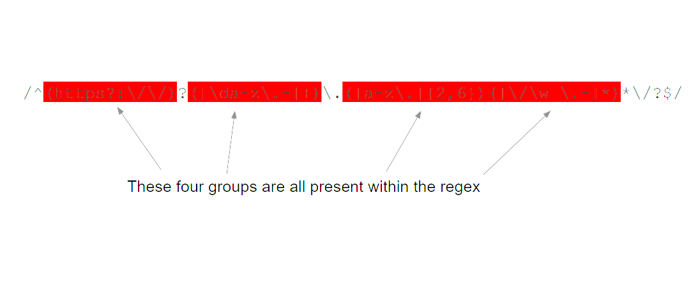
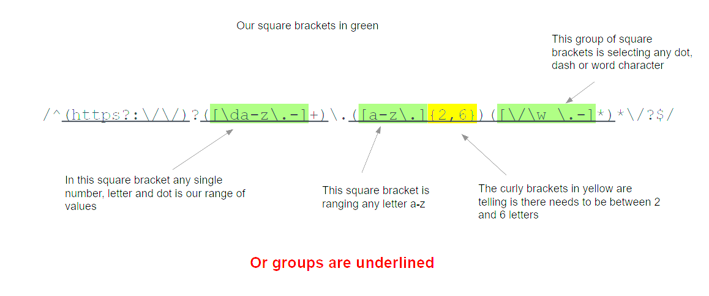
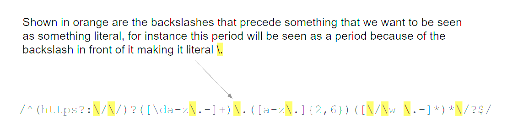

# Using Regex (Regular Expressions) to Match a URL

Using regex to match a URL is a very useful method used everyday by many to help validate, locate and detect what a specific string will contain. Regular expressions may look like a jumbled together clump of random words letters and special characters. But every single one of those characters helps distinguish if the string is trying to fetch a certain page or a web address itself, among other possiblities.

## Summary

I will be breaking down the regex below and will walk through each step needed to decipher what is happening 
```
/^(https?:\/\/)?([\da-z\.-]+)\.([a-z\.]{2,6})([\/\w \.-]*)*\/?$/
```

The table of contents below will show which components I will be using while explaining what each component does in detail when clicked on

## Table of Contents

- [Anchors](#anchors)
- [Quantifiers](#quantifiers)
- [Character Classes](#character-classes)
- [Flags](#flags)
- [Grouping](#grouping)
- [Bracket Expressions](#bracket-expressions)
- [Boundaries](#boundaries)
- [Character Escapes](#character-escapes)

## Regex Components

### Anchors
In this regex the anchors ^ and $ both signal start and end of a text

Both of these anchor symbols can be used to check if the string matches pattern, this is shown in the example I have made below



### Quantifiers

In this URL there are some quantifies present, seen in the picture below I point out which quantifiers are present and what they are doing. 

- The * quantifier = Matches the pattern zero or more times 
- The + quantifier = Matches the pattern one or more times
- The ? quantifier = Matches the pattern zero or one time only
- The {} quantifier = makes three ways to set limits listed below
- { x } matches the pattern specifically x times
- { x, } matches the pattern at least x times
- { x,y } matches the pattern at a minimum of x times to a max of y

Quantifiers are seen as greedy meaning they will try to match as many occurances as possible, by putting a ? after some quantifiers it makes said quantifier LAZY meaning it will only match as few occurences as possible


### Character Classes
Character classes help us select ranges, whether it be a range of numbers or word characters or another range of values chacter classes
- \d matches any numeral digit
- \s matches a whitespace charcter including any tab or line-break
- \w matches any alphanumeric character and the underscore character(_)

This specific URL regex uses \d and \w shown below in purple


### Grouping
When grouping in this regex, using the parentheses will group elements together and make our quantifiers work. Whether the quantifiers are being refered to at a specific time or a later date

In the picture below we can see that we have four groups highlighted in red 


### Bracket Expressions
Like stated above when we use parentheses to enclose elements together we create a group

However when we use square brackets [ ] they create our [Character Classes](#character-classes) and our curly brackets { } act as our [Quantifiers](#quantifiers)


### Greedy and Lazy Match
Mentioned in [Quantifiers](#quantifiers)
### Character Escapes

In a regex such as this one we can see the backslash is used quite a bit, This is because the backslash escapes a character that would have been interperated as its original self. This means that these native characters listed below can be escaped by a backslash 
```
. / * | } ] ) ? 
```
For instance in the picture below we can see that the backslashes are interpreted as literal backslashes because of the forward slash in front of it, and quite literally the same with the period before group 3 and in group 4 along with other examples within the picture


## Author

I am a student in The University of Arizona's Full Stack Web Development bootcamp find all of my work here! [Parker's Github](https://github.com/Pscully21) 
Thank You!
